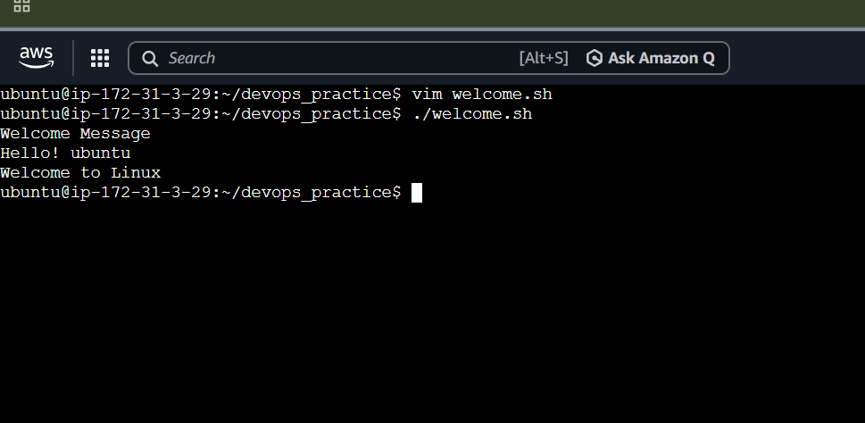
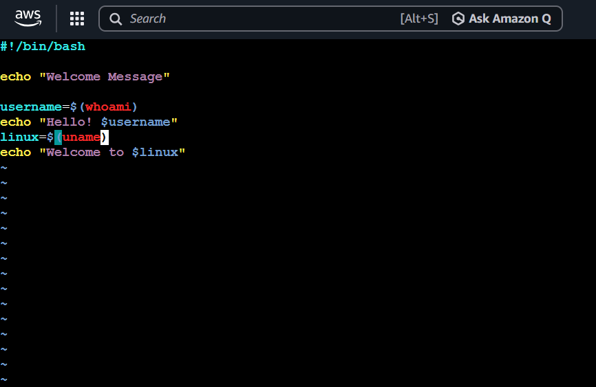
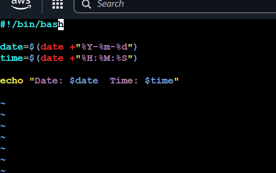
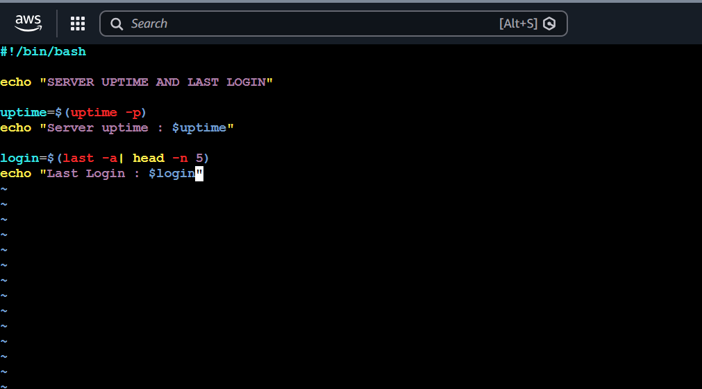
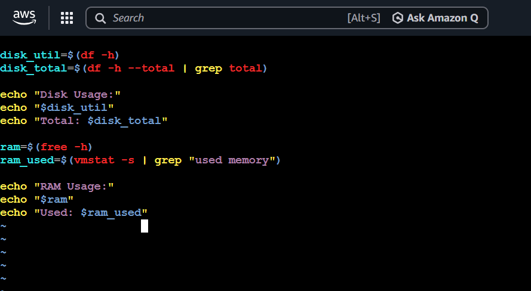
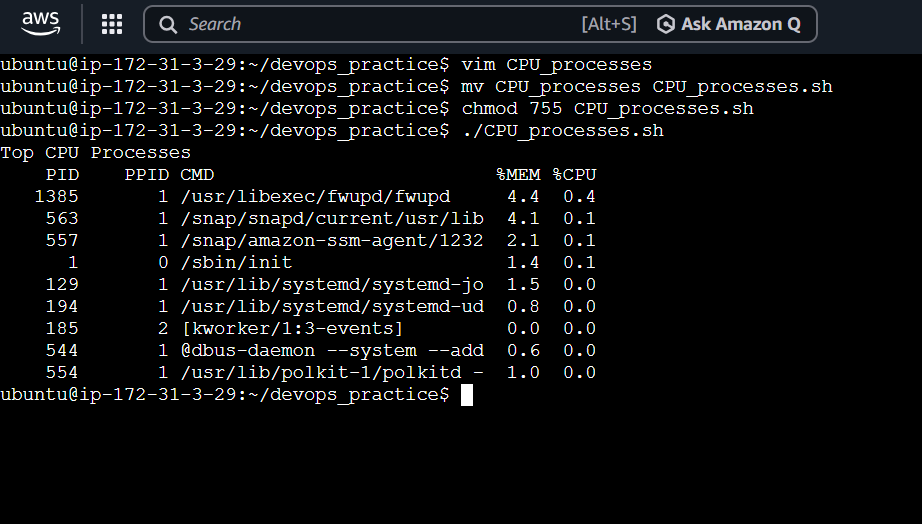
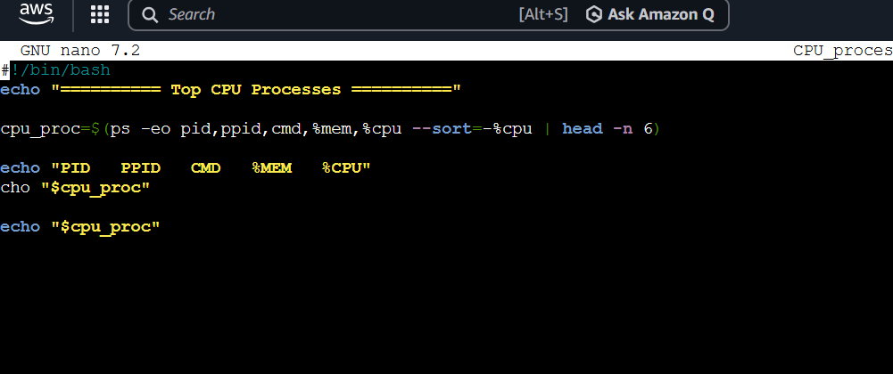
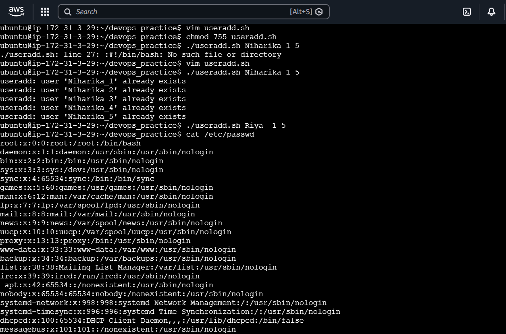
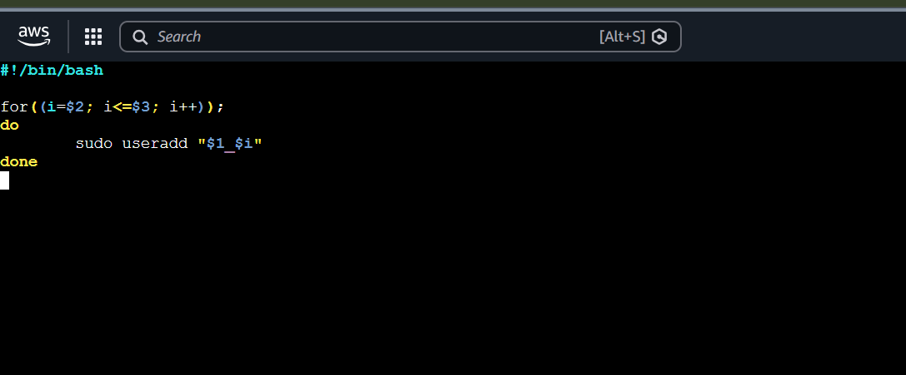

# Shell Scripting Mini Project

This project demonstrates a Linux Shell Script that displays useful system information and provides a personalized welcome message to the user.

---

## 📌 Project Objectives

- Welcome the user with a personalized greeting
- Display current date and time
- Show server uptime and last login details
- Display disk space and RAM utilization
- Show top CPU-consuming processes
- Add beautification and extra useful commands

---

## Task 1 :- Welcome User with Username Greeting  

---

## Task 2 :- Show Current Date and Time  

---

## Task 3 :- Show Server Uptime and Last Logins  

---

## Task 4 :- Show Disk Space and RAM Utilization  

---

## Task 5 :- Show Top CPU Processes  

---

## Task 6 :- Additional Beautification and Extra Commands  

---

## 🛠 Technologies Used

- Linux
- Bash Shell Scripting
- System Monitoring Commands

